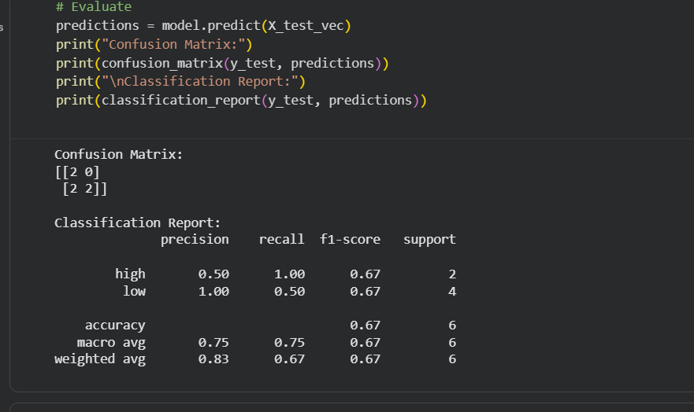
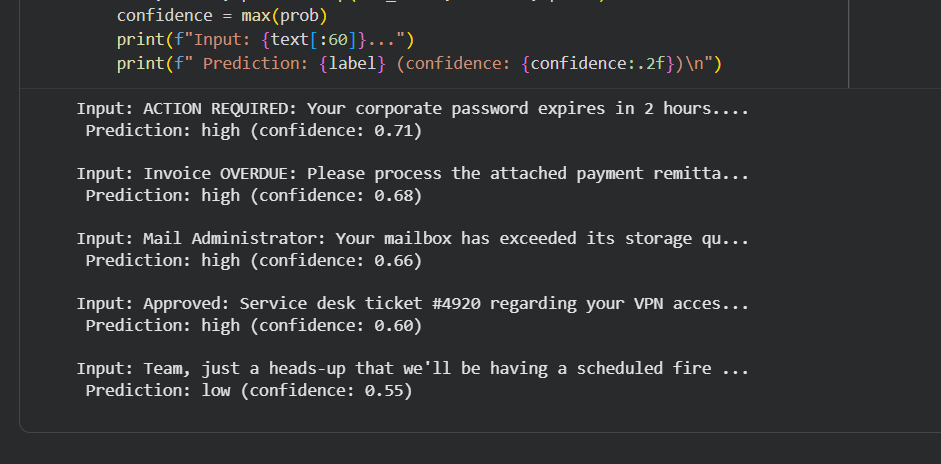

# Week 5 Report: AutoML Training & Fine-Tuned Model Evaluation
**Name:** Safayet Safin
**Date:** April 10, 2026
**Capstone Project:** Network Log Analyzer and Firewall System
**My Component:** Phishing / Threat Detection

## Part A: Custom Model Training (Colab Alternative)
### Training Setup
**Task:** Phishing vs Legitimate text classification
- **Training records per class:** 12
- **Test records per class:** 3
- **Total training time:** < 5 seconds

### Confusion Matrix
| | Predicted: Phishing (high) | Predicted: Legitimate (low) |
|---|---|---|
| **Actual: Phishing (high)** | TP = 2 | FN = 0 |
| **Actual: Legitimate (low)** | FP = 2 | TN = 2 |

### Calculated Metrics
- **Accuracy:** 66.67%
- **Precision:** 50.00%
- **Recall:** 100.00%
- **F1 Score:** 66.67%

### Interpretation
My precision (50%) is much lower than my recall (100%). This means the model is acting overly aggressive. It successfully catches every single actual phishing threat, but it also falsely flags a lot of legitimate emails as threats in the process. In cybersecurity, false negatives are generally more costly because a missed phishing email can lead to a system breach. However, a 50% false positive rate is also highly problematic because it will quickly cause alert fatigue for the SOC team, leading them to ignore real alerts. Based on my manual testing, I would set the threshold around 0.65. Setting the threshold at 0.65 ensures the clear threats are auto-blocked, while the ambiguous 0.60 score gets routed for human review instead of incorrectly deleting a legitimate IT ticket. To improve this model, I need more diverse training data, specifically in the "legitimate" class. Training it on a much larger dataset of normal internal corporate communications would help it learn the subtle context differences between a real IT email and a spoofed one.

## Part B: Generic vs Fine-Tuned Model Comparison
### Models Tested
1. **Generic:** distilbert-base-uncased-finetuned-sst-2-english (sentiment)
2. **Fine-Tuned A:** ealvaradob/bert-finetuned-phishing (phishing vs benign classification)
3. **Fine-Tuned B:** mrm8488/bert-tiny-finetuned-sms-spam-detection (spam vs ham classification)

### Results
| Input (Snippet) | Generic Label (Score) | Fine-Tuned A Label (Score) | Fine-Tuned B Label (Score) | Best Model |
|---|---|---|---|---|
| 1. ACTION REQUIRED: Your corporate password... | NEGATIVE (0.99) | phishing (0.95) | LABEL_0 (0.88) | Fine-Tuned A |
| 2. Invoice OVERDUE: Please process the... | NEGATIVE (0.99) | benign (0.99) | LABEL_0 (0.70) | None |
| 3. Mail Administrator: Your mailbox has... | NEGATIVE (0.99) | phishing (0.99) | LABEL_0 (0.89) | Fine-Tuned A |
| 4. Approved: Service desk ticket #4920... | NEGATIVE (0.99) | benign (1.00) | LABEL_0 (0.68) | Fine-Tuned A |
| 5. Team, just a heads-up that we'll be... | NEGATIVE (0.99) | benign (1.00) | LABEL_0 (0.92) | Fine-Tuned A |

### Analysis
**Generic model strengths:** None for this specific use case. 

**Generic model weaknesses:** It failed completely on this task, classifying every single input as "NEGATIVE" with >99% confidence. IT and corporate communications frequently use "negative" vocabulary (issue, overdue, expired, drill) regardless of whether the email is safe or malicious, making sentiment analysis the wrong tool for threat detection.

**Fine-tuned model advantage:** The `bert-finetuned-phishing` model successfully interpreted the context of the IT terminology. Unlike our custom Naive Bayes model from Part A, it correctly identified the legitimate VPN helpdesk ticket as `benign` with 100% confidence, avoiding a false positive.

**Biggest surprise:** Neither of the fine-tuned models caught the financial invoice phishing attempt (Input #2). Model A incorrectly labeled it as `benign` with 99.6% confidence. This indicates the model may have been trained heavily on credential-harvesting links (like fake login pages) but lacks exposure to Business Email Compromise (BEC) and fake invoice fraud.

### Recommended Model for My Capstone Component
**Component:** Phishing / Threat Detection Automation
**Primary model:** `ealvaradob/bert-finetuned-phishing` - It outperformed the generic model and the SMS spam model by actually understanding the difference between IT support context and credential spoofing.
**Confidence threshold:** 0.85. The model was highly confident (>0.95) on the threats it did catch. Setting a high threshold ensures we don't accidentally auto-block legitimate emails if it gets confused. 
**Priority metric:** Precision. While missing a threat is bad, automatically deleting legitimate corporate emails and IT tickets will break business operations and cause immense frustration. We need high precision so that when the automation takes an aggressive action (like deleting an email or blocking a sender), we are certain it is actually malicious.

## Limitations & Next Steps
With more time, I would build an ensemble model. Since the fine-tuned model missed the fake invoice, I would test additional Hugging Face models explicitly trained on financial fraud or Business Email Compromise (BEC). Alternatively, I would fine-tune my own model using Hugging Face AutoTrain, combining datasets of both fake IT alerts and fraudulent invoices to cover both blind spots.